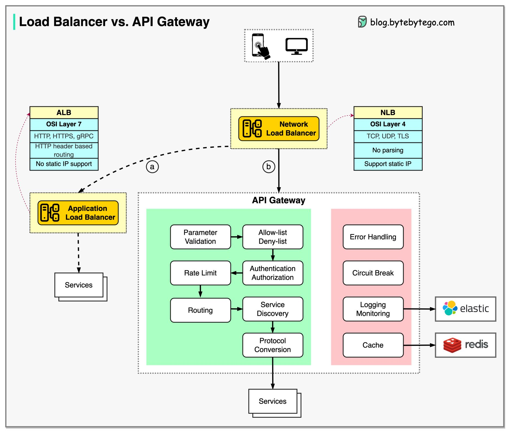

# Load Balancer vs. API Gateway

* NLB(Network Load Balancer) is usually deployed before API Gateway, handling traffic routing based on IP. It doesnot parse http requests.
* ALB(Application Load Balanceer) routes requests based on http header or URL and thus can provide richer routing rules.
	* We can choose load balancer based on routing requirements.
	* For simple services with a small scale, one load balancer is enough.
* The API Gateway performs tasks more on the application level. So it has different responsibilities from the load balancer.

## Option A

* ALB is used to distribute requests among different services. Due to the fact that the services implement their own rating limitation, authentication etc.
* This approach is more flexible but requires more work at the service level.

## Option B

* An API Gateway takes care of authentication, rate limiting, caching, etc. so there is less work at the service level. However this option is less flexible compared to ALB approach.

 
